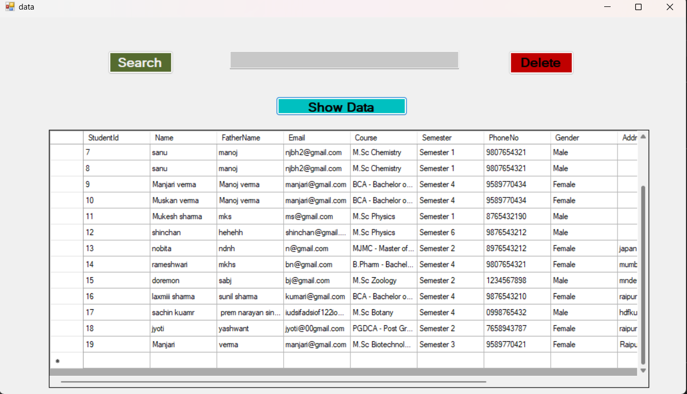
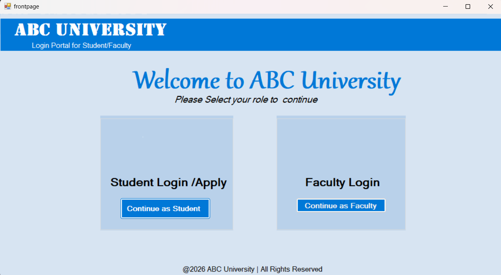

# student-admission-system
A VB.NET Windows desktop application for managing student admissions. Students can fill admission forms which are stored in SQL Server database. Faculty/admin can log in to view and manage submitted applications, making the admission process simple, organized, and efficient.

##vb.net images

###Faculty login form

###Front page

###student form
![student form](student form.png0

